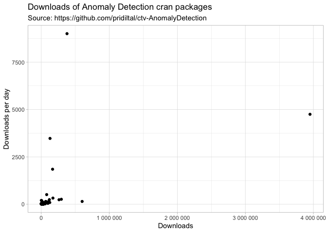

CRAN Anomaly
================
Stephan
2/21/2022

<!-- README.md is generated from README.Rmd. Please edit that file -->

    #> Joining, by = "package"
    #> # A tibble: 117 × 6
    #>     package                       n published  age       downloads      hotness
    #>     <chr>                     <dbl> <chr>      <drtn>    <list>           <dbl>
    #>   1 forecast                 378142 2022-01-10   42 days <df [43 × 3]>  9003.  
    #>   2 kernlab                 3950285 2019-11-12  832 days <df [833 × 3]> 4748.  
    #>   3 dbscan                   128545 2022-01-15   37 days <df [38 × 3]>  3474.  
    #>   4 DescTools                166417 2021-11-23   90 days <df [91 × 3]>  1849.  
    #>   5 seasonal                  79454 2021-09-18  156 days <df [157 × 3]>  509.  
    #>   6 TSA                      171293 2020-09-13  526 days <df [527 × 3]>  326.  
    #>   7 rainbow                  295084 2019-01-29 1119 days <df>            264.  
    #>   8 anomalize                118698 2020-10-20  489 days <df [490 × 3]>  243.  
    #>   9 tsoutliers               261146 2019-02-24 1093 days <df>            239.  
    #>  10 surveillance               1015 2022-02-16    5 days <df [6 × 3]>    203   
    #>  11 compositions               8637 2022-01-05   47 days <df [48 × 3]>   184.  
    #>  12 FactoInvestigate          64925 2020-12-11  437 days <df [438 × 3]>  149.  
    #>  13 outliers                 600753 2011-01-24 4046 days <df>            148.  
    #>  14 ddalpha                  106211 2020-01-09  774 days <df [775 × 3]>  137.  
    #>  15 funModeling               77509 2020-06-15  616 days <df [617 × 3]>  126.  
    #>  16 mvoutlier                 21662 2021-07-30  206 days <df [207 × 3]>  105.  
    #>  17 fda.usc                   74224 2020-02-17  735 days <df [736 × 3]>  101.  
    #>  18 bigutilsr                 29609 2021-04-13  314 days <df [315 × 3]>   94.3 
    #>  19 qpcR                     124909 2018-06-14 1348 days <df>             92.7 
    #>  20 solitude                  15349 2021-07-29  207 days <df [208 × 3]>   74.1 
    #>  21 DDoutlier                 90443 2018-05-30 1363 days <df>             66.4 
    #>  22 Rlof                      35365 2020-07-02  599 days <df [600 × 3]>   59.0 
    #>  23 DMwR2                     98043 2016-10-13 1957 days <df>             50.1 
    #>  24 Morpho                     8116 2021-09-09  165 days <df [166 × 3]>   49.2 
    #>  25 univOutl                  16254 2021-03-17  341 days <df [342 × 3]>   47.7 
    #>  26 isotree                     360 2022-02-13    8 days <df [9 × 3]>     45   
    #>  27 rrcovHD                   13103 2021-04-23  304 days <df [305 × 3]>   43.1 
    #>  28 outbreaks                 21892 2020-09-28  511 days <df [512 × 3]>   42.8 
    #>  29 CoordinateCleaner          5137 2021-10-21  123 days <df [124 × 3]>   41.8 
    #>  30 outliertree                 151 2022-02-17    4 days <df [5 × 3]>     37.8 
    #>  31 GmAMisc                   12301 2021-03-29  329 days <df [330 × 3]>   37.4 
    #>  32 adamethods                19679 2020-08-04  566 days <df [567 × 3]>   34.8 
    #>  33 ICSOutlier                48081 2018-02-02 1480 days <df>             32.5 
    #>  34 ANN2                      13414 2020-12-01  447 days <df [448 × 3]>   30.0 
    #>  35 extremevalues             18686 2020-05-18  644 days <df [645 × 3]>   29.0 
    #>  36 pcadapt                   18680 2020-05-05  657 days <df [658 × 3]>   28.4 
    #>  37 HDoutliers                  276 2022-02-11   10 days <df [11 × 3]>    27.6 
    #>  38 cellWise                   9608 2021-03-09  349 days <df [350 × 3]>   27.5 
    #>  39 mrfDepth                  14869 2020-08-26  544 days <df [545 × 3]>   27.3 
    #>  40 anomaly                    3348 2021-10-20  124 days <df [125 × 3]>   27   
    #>  41 rgr                       38116 2018-03-05 1449 days <df>             26.3 
    #>  42 MALDIrppa                   181 2022-02-14    7 days <df [8 × 3]>     25.9 
    #>  43 fdasrvf                    6293 2021-06-21  245 days <df [246 × 3]>   25.7 
    #>  44 StatDA                    18248 2020-03-10  713 days <df [714 × 3]>   25.6 
    #>  45 faoutlier                 10030 2021-01-10  407 days <df [408 × 3]>   24.6 
    #>  46 DJL                        6635 2021-05-20  277 days <df [278 × 3]>   24.0 
    #>  47 seismicRoll               13903 2020-07-08  593 days <df [594 × 3]>   23.4 
    #>  48 ACA                       31182 2018-07-02 1330 days <df>             23.4 
    #>  49 kmodR                     57550 2015-03-26 2524 days <df>             22.8 
    #>  50 dixonTest                  6144 2021-05-20  277 days <df [278 × 3]>   22.2 
    #>  51 ABPS                      26628 2018-10-18 1222 days <df>             21.8 
    #>  52 enpls                     21279 2019-05-18 1010 days <df>             21.1 
    #>  53 FastPCS                   27869 2018-05-22 1371 days <df>             20.3 
    #>  54 densratio                 19602 2019-06-30  967 days <df [968 × 3]>   20.3 
    #>  55 referenceIntervals        13441 2020-04-18  674 days <df [675 × 3]>   19.9 
    #>  56 probout                     199 2022-02-11   10 days <df [11 × 3]>    19.9 
    #>  57 outbreaker2                7283 2021-02-09  377 days <df [378 × 3]>   19.3 
    #>  58 FastHCS                   12476 2020-05-10  652 days <df [653 × 3]>   19.1 
    #>  59 crseEventStudy             7628 2021-01-11  406 days <df [407 × 3]>   18.8 
    #>  60 clampSeg                    458 2022-01-27   25 days <df [26 × 3]>    18.3 
    #>  61 amelie                    18745 2019-03-18 1071 days <df>             17.5 
    #>  62 OutliersO3                11634 2020-04-25  667 days <df [668 × 3]>   17.4 
    #>  63 outForest                   362 2022-01-31   21 days <df [22 × 3]>    17.2 
    #>  64 EFDR                       5263 2021-04-18  309 days <df [310 × 3]>   17.0 
    #>  65 FastRCS                   23447 2018-05-13 1380 days <df>             17.0 
    #>  66 SeleMix                    7367 2020-11-29  449 days <df [450 × 3]>   16.4 
    #>  67 abnormality               23538 2018-03-13 1441 days <df>             16.3 
    #>  68 NMAoutlier                 2156 2021-10-11  133 days <df [134 × 3]>   16.2 
    #>  69 otsad                     14290 2019-09-06  899 days <df [900 × 3]>   15.9 
    #>  70 CerioliOutlierDetection   26558 2017-07-25 1672 days <df>             15.9 
    #>  71 waterData                 27710 2017-04-28 1760 days <df>             15.7 
    #>  72 dobin                     11330 2020-02-24  728 days <df [729 × 3]>   15.6 
    #>  73 dave                      24770 2017-10-13 1592 days <df>             15.6 
    #>  74 ldbod                     26818 2017-05-26 1732 days <df>             15.5 
    #>  75 alphaOutlier              30689 2016-09-09 1991 days <df>             15.4 
    #>  76 cbar                      24265 2017-10-24 1581 days <df>             15.3 
    #>  77 hotspots                  20916 2018-05-30 1363 days <df>             15.3 
    #>  78 kuiper.2samp              17491 2018-12-18 1161 days <df>             15.1 
    #>  79 abodOutlier               35501 2015-08-31 2366 days <df>             15.0 
    #>  80 bagged.outliertrees        3384 2021-07-06  230 days <df [231 × 3]>   14.7 
    #>  81 MGBT                       3152 2021-07-21  215 days <df [216 × 3]>   14.7 
    #>  82 envoutliers                9478 2020-05-07  655 days <df [656 × 3]>   14.5 
    #>  83 biogeo                    30860 2016-04-08 2145 days <df>             14.4 
    #>  84 modi                      16222 2018-11-20 1189 days <df>             13.6 
    #>  85 wql                       22963 2017-07-04 1693 days <df>             13.6 
    #>  86 Routliers                 13579 2019-05-23 1005 days <df>             13.5 
    #>  87 molic                      3555 2021-06-02  264 days <df [265 × 3]>   13.5 
    #>  88 fdaoutlier                 4785 2021-03-02  356 days <df [357 × 3]>   13.4 
    #>  89 rIP                       13100 2019-05-29  999 days <df>             13.1 
    #>  90 leri                      11721 2019-09-09  896 days <df [897 × 3]>   13.1 
    #>  91 npphen                     1211 2021-11-20   93 days <df [94 × 3]>    13.0 
    #>  92 stray                      7762 2020-06-29  602 days <df [603 × 3]>   12.9 
    #>  93 boutliers                  6076 2020-11-04  474 days <df [475 × 3]>   12.8 
    #>  94 trendsegmentR              1195 2021-11-19   94 days <df [95 × 3]>    12.7 
    #>  95 oddstream                 10121 2019-12-16  798 days <df [799 × 3]>   12.7 
    #>  96 precintcon                25862 2016-07-17 2045 days <df>             12.6 
    #>  97 composits                  6402 2020-09-30  509 days <df [510 × 3]>   12.6 
    #>  98 evtclass                  14962 2018-11-16 1193 days <df>             12.5 
    #>  99 outlierensembles           3075 2021-06-15  251 days <df [252 × 3]>   12.3 
    #> 100 extremeIndex               1076 2021-11-24   89 days <df [90 × 3]>    12.1 
    #> 101 CircOutlier               26969 2016-01-12 2232 days <df>             12.1 
    #> 102 wbacon                     1312 2021-11-04  109 days <df [110 × 3]>   12.0 
    #> 103 pasadr                     2809 2021-06-30  236 days <df [237 × 3]>   11.9 
    #> 104 lookout                    4295 2021-02-12  374 days <df [375 × 3]>   11.5 
    #> 105 SMLoutliers               21097 2017-02-06 1841 days <df>             11.5 
    #> 106 surveyoutliers            25415 2016-01-25 2219 days <df>             11.5 
    #> 107 oclust                    10275 2019-08-29  907 days <df [908 × 3]>   11.3 
    #> 108 OutlierDM                 29611 2014-12-24 2616 days <df>             11.3 
    #> 109 depth.plot                24708 2015-12-20 2255 days <df>             11.0 
    #> 110 quokar                    16953 2017-11-10 1564 days <df>             10.8 
    #> 111 sGMRFmix                  14686 2018-04-16 1407 days <df>             10.4 
    #> 112 washeR                    13297 2018-07-12 1320 days <df>             10.1 
    #> 113 survBootOutliers          13418 2018-05-28 1365 days <df>              9.83
    #> 114 semdiag                   34432 2012-01-30 3675 days <df>              9.37
    #> 115 spikes                    18429 2016-09-22 1978 days <df>              9.32
    #> 116 RWBP                      25743 2014-06-24 2799 days <df>              9.20
    #> 117 MIPHENO                   32028 2012-01-27 3678 days <df>              8.71

<!-- -->
